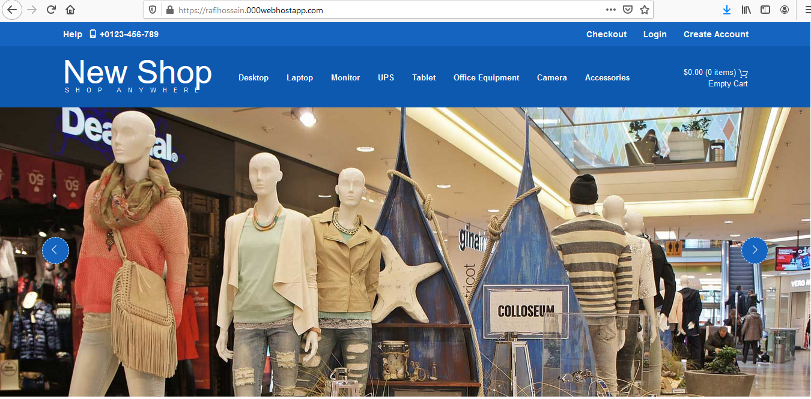
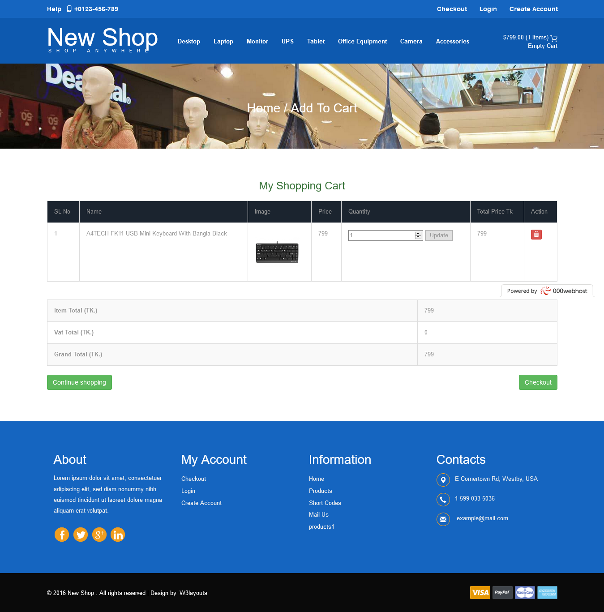
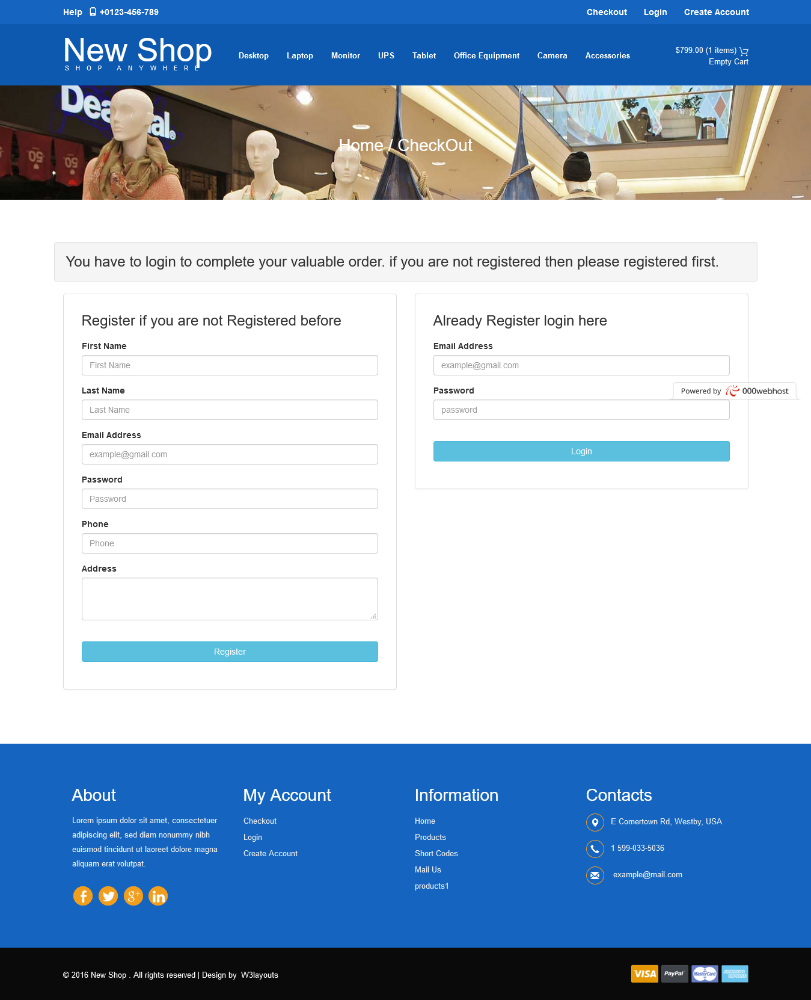
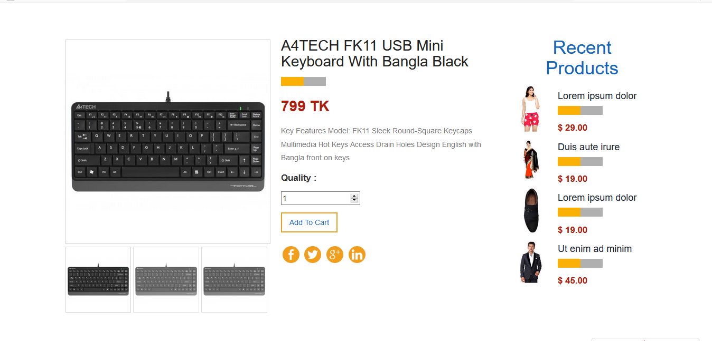
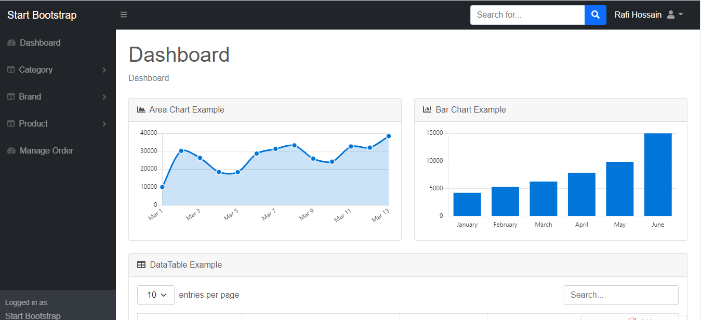
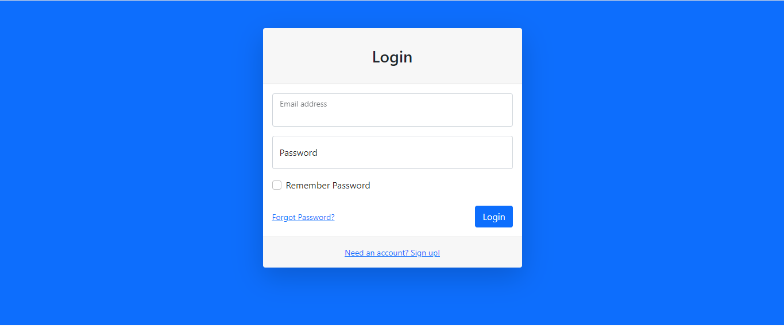
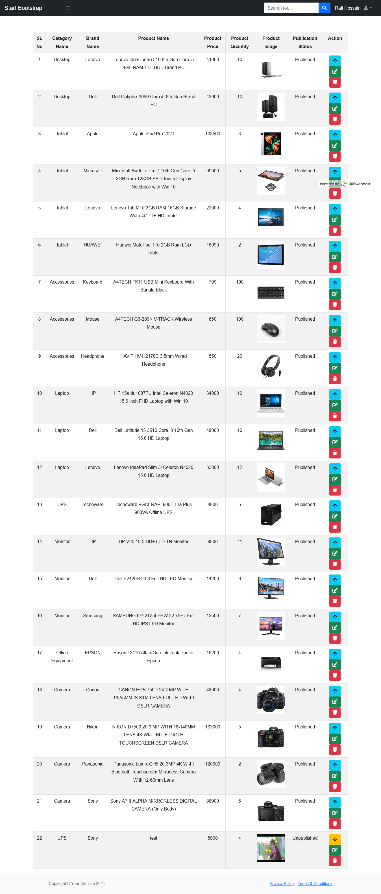
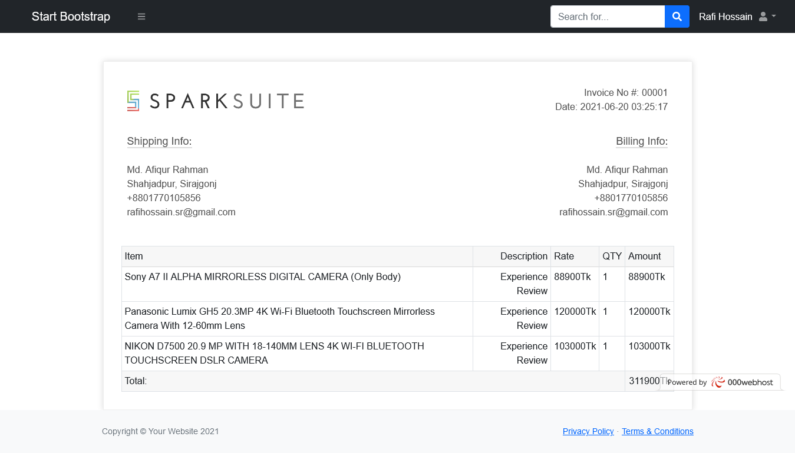
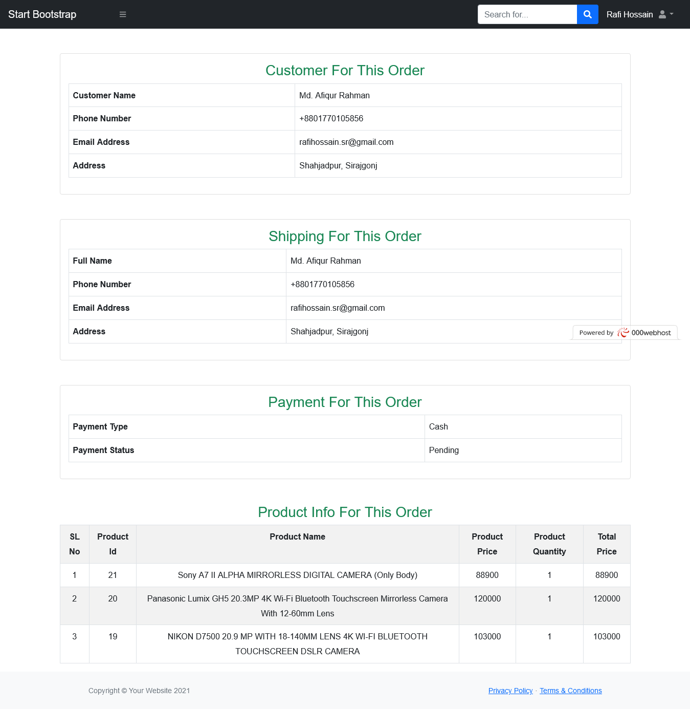

<h2>Laravel E-Commarce Website:</h2>
<h3> Feature's </h3>	

•	Add and manage category, brand, product and order information. 
•	Product add to cart, quantity update and delete cart product 
•	logout, user, authentication and registration features. 
•	Invoice view and download system 
Technology Used: 
	Laravel, PHP, MySQl, Html, Css, JavaScript, Bootstrap And Jquery.

<h3>Project Screenshot</h3>
  
  
  
  
  
  
  
  
  
<h3>Installation</h3>

Clone the repo git clone https://github.com/rafihossain/laravel-ecommarce-project.git
cd to project folder.

1) Run composer install

Save as the .env.example to .env and set your database information for this type

2) copy .env.example .env

3)Run php artisan key:generate to generate the app key

5)Run php artisan migrate

6)Run php artisan serve